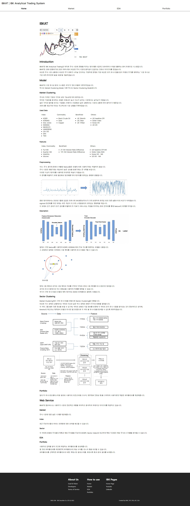
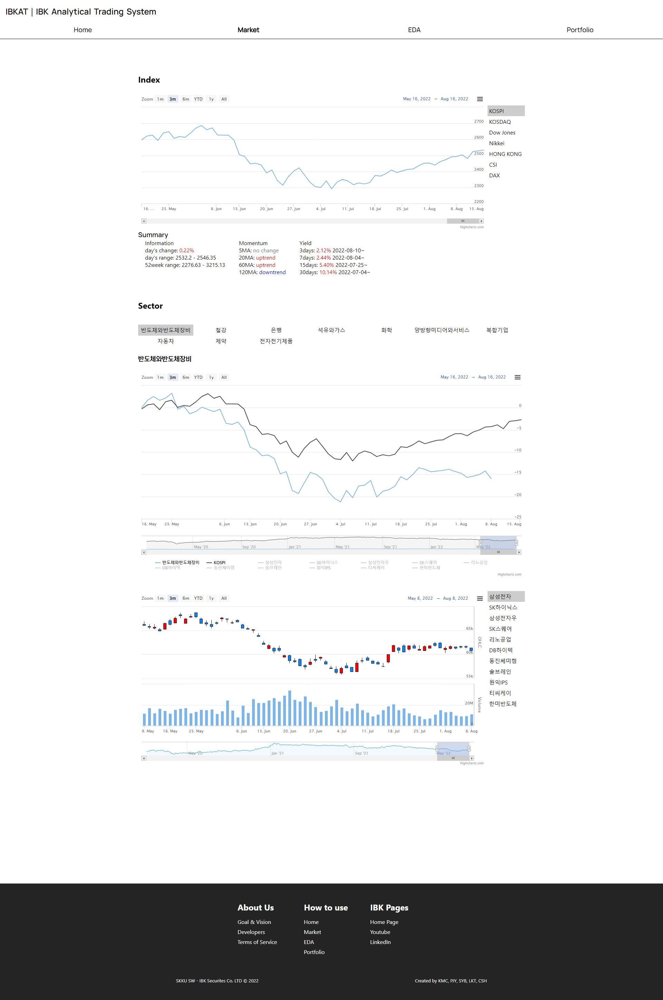
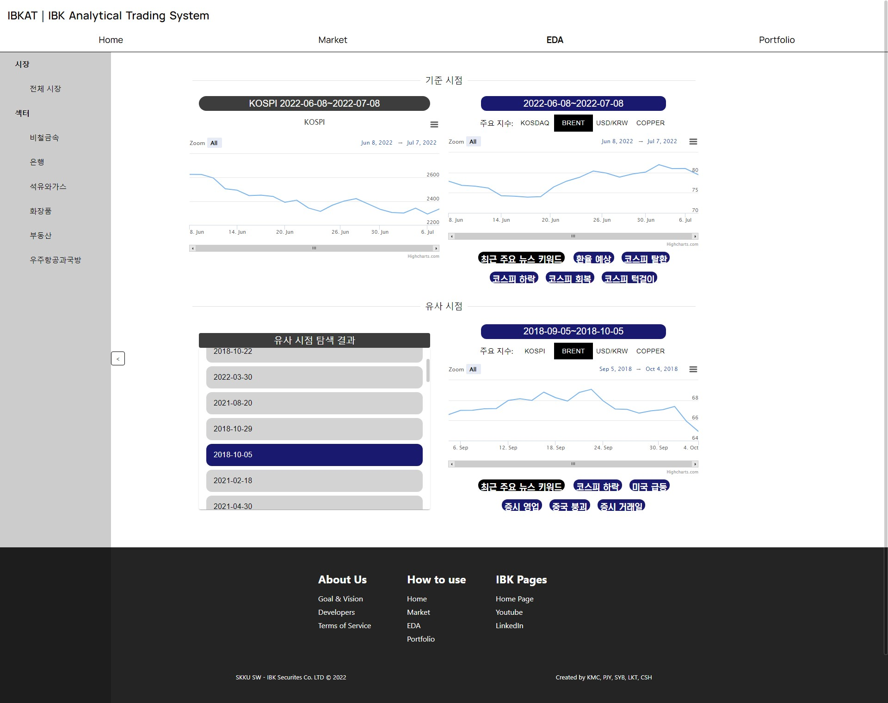
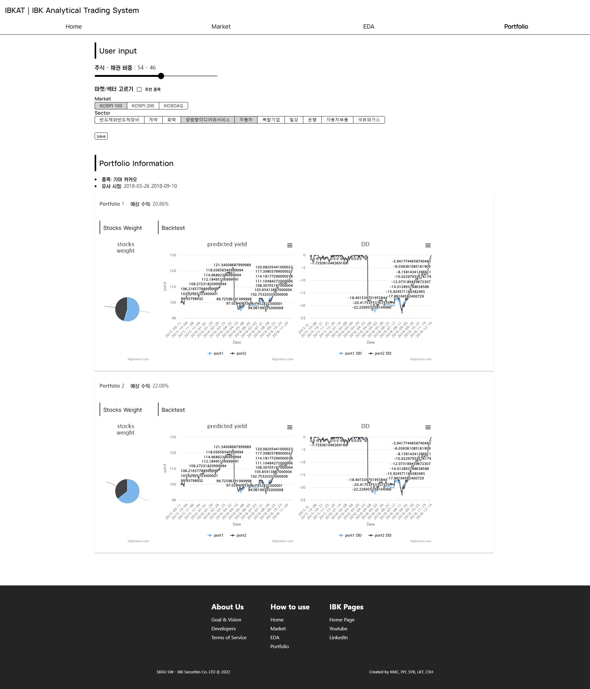

# 2022 IBK 산학협력프로젝트
front: React.js  
back: Django  
db: Mongo  
proxy server: nginx  
MSA Architecture  
deploy: AWS

## 실행 방법
`sudo docker-compose up`
을 프로젝트 최상단 디렉토리에서 실행

localhost:80에서 접속 가능

## 포스터

## 설명 영상 (YouTube)

## 실행 화면
### Home

### Market

### EDA

### Portfolio

